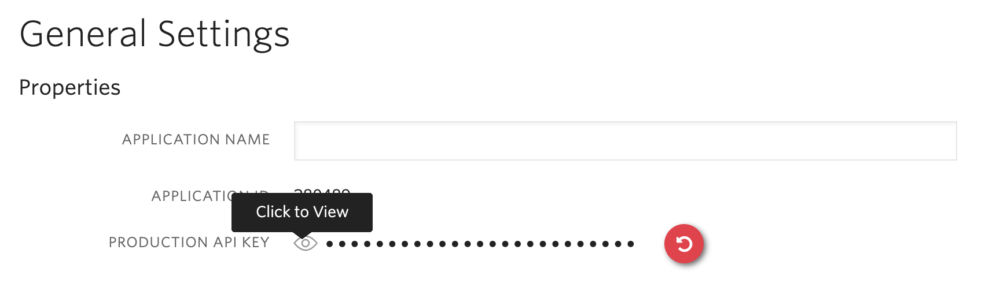

<a  href="https://www.twilio.com">

</a>

# Twilio Account Security Quickstart - Twilio Authy and Twilio Verify


> We are currently in the process of updating this sample template. If you are encountering any issues with the sample, please open an issue at [github.com/twilio-labs/code-exchange/issues](https://github.com/twilio-labs/code-exchange/issues) and we'll try to help you.

## About

A simple Java, Spring and AngularJS implementation of a website that uses Twilio Authy to protect all assets within a folder with two-factor authentication. Additionally, it shows a Verify Phone Verification implementation.

It uses four channels for delivery, SMS, Voice, Soft Tokens, and Push Authentication. You should have the [Authy App](https://authy.com/download/) installed to try Soft Token and Push Authentication support.

Learn more about Account Security and when to use the Authy API vs the Verify API in the [Account Security documentation](https://www.twilio.com/docs/verify/authy-vs-verify).

Implementations in other languages:

| .NET | Python | Node | PHP | Ruby |
| :--- | :--- | :----- | :-- | :--- |
| TBD | [Done](https://github.com/TwilioDevEd/account-security-quickstart-django)  | [Done](https://github.com/TwilioDevEd/account-security-quickstart-node)  | [Done](https://github.com/TwilioDevEd/account-security-quickstart-php) | [Done](https://github.com/TwilioDevEd/account-security-quickstart-rails)  |

### Features

- URL path "/protected" is protected with both user session and Twilio Authy Two-Factor Authentication
- One Time Passwords (SMS and Voice)
- SoftTokens
- Push Notifications (via polling)
- Phone Verification
  - SMS or Voice Call

<!--
### How it works

**TODO: Describe how it works**
-->

## Set up

### Requirements

- [Java Development Kit](https://adoptopenjdk.net/) version 11 or later.
- A Twilio account - [sign up](https://www.twilio.com/try-twilio)

### Twilio Account Settings

This application should give you a ready-made starting point for writing your
own appointment reminder application. Before we begin, we need to collect
all the config values we need to run the application:

| Config&nbsp;Value | Description                                                                                                                                                  |
| :---------------- | :----------------------------------------------------------------------------------------------------------------------------------------------------------- |
 Account&nbsp;Sid  | Your primary Twilio account identifier - find this [in the Console](https://www.twilio.com/console).                                                         |
| Auth&nbsp;Token   | Used to authenticate - [just like the above, you'll find this here](https://www.twilio.com/console).                                                         |
| Verification&nbsp;Sid |  For Verification Service. You can generate one [here](https://www.twilio.com/console/verify/services) |
| Account Security Api Key  | Create a new Authy application in the [console](https://www.twilio.com/console/authy/). After you give it a name you can view the generated Account Security production API key. This is the string you will later need to set up in your environmental variables.|

### How to get an Authy API Key

You will need to create a new Authy application in the [console](https://www.twilio.com/console/authy/). After you give it a name you can view the generated Account Security production API key. This is the string you will later need to set up in your environmental variables.



### Local development

After the above requirements have been met:

1. Clone this repository and `cd` into it

    ```bash
    git clone git@github.com:TwilioDevEd/account-security-quickstart-spring.git
    cd account-security-quickstart-spring
    ```

2. Set your environment variables

    ```bash
    cp .env.example .env
    ```

    See [Twilio Account Settings](#twilio-account-settings) to locate the necessary environment variables.

    If you are using a UNIX operating system, load the environment variables before the application starts.

    ```bash
    source .env
    ```

    _If you are using a different operating system, make sure that all the variables from the `.env` file are loaded into your environment._

3. Run the application

    ```bash
    make serve
    ```
    **NOTE:** If you are using a dedicated Java IDE like Eclipse or IntelliJ, you can start the application within the IDE and it will start in development mode, which means any changes on a source file will be automatically reloaded.

4. Navigate to [http://localhost:8080](http://localhost:8080)

That's it!

### Tests

You can run the tests locally by typing:

```bash
./gradlew test
```

### Cloud deployment

Additionally to trying out this application locally, you can deploy it to a variety of host services. Here is a small selection of them.

Please be aware that some of these might charge you for the usage or might make the source code for this application visible to the public. When in doubt research the respective hosting service first.

| Service                           |                                                                                                                                                                                                                           |
| :-------------------------------- | :------------------------------------------------------------------------------------------------------------------------------------------------------------------------------------------------------------------------ |
| [Heroku](https://www.heroku.com/) | [](https://heroku.com/deploy?template=https://github.com/TwilioDevEd/account-security-quickstart-spring/tree/master)                                                                                                                                       |

**Some notes:** 
- For Heroku, please [check this](https://devcenter.heroku.com/articles/deploying-gradle-apps-on-heroku) to properly configure the project for deployment.
- You can also follow [this guide](https://vaadin.com/blog/how-to-deploy-your-java-app-to-the-cloud) to deploy the application to several other cloud services including Google Cloud, Oracle Cloud, etc.

## Resources

- The CodeExchange repository can be found [here](https://github.com/twilio-labs/code-exchange/).

## Contributing

This template is open source and welcomes contributions. All contributions are subject to our [Code of Conduct](https://github.com/twilio-labs/.github/blob/master/CODE_OF_CONDUCT.md).

## License

[MIT](http://www.opensource.org/licenses/mit-license.html)

## Disclaimer

No warranty expressed or implied. Software is as is.

[twilio]: https://www.twilio.com
